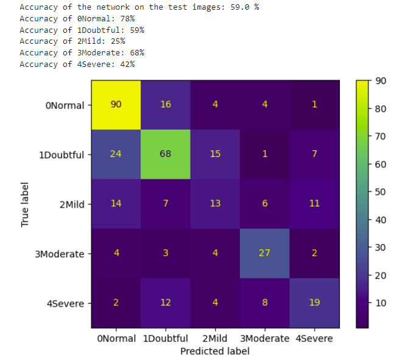

# Knee Knet: A Convolutional Neural Network to Predict Osteoarthritis in X-Rays

## NON-TECHNICAL EXPLANATION OF YOUR PROJECT
The goal of this project was to build a deep learning algorithm that could determine the severity of osteoarthritis given an x-ray image of a human knee. The images were classified by experts according to the Kellgren and Lawrence scale. Each image was given one of five grades, ranging from Normal (G0) to Severe (G4). A total of 1098 x-rays were used for training the algorithm. The final algorithm was able to correctly grade 59% of the 366 unseen test images. 

## DATA
The dataset used consists of 1650 x-ray images of single and pairs of human knees. The original data is from Mendeley Data: 

Chen, Pingjun (2018), “Knee Osteoarthritis Severity Grading Dataset”, Mendeley Data, V1, doi: 10.17632/56rmx5bjcr.1 (see: https://data.mendeley.com/datasets/56rmx5bjcr/1)

The dataset was organised by the Osteoarthritis Initiative (OAI).

The 1464 x-rays of single knees were extracted to use for testing and training the model. The remaining x-rays containing two knees together were discarded.

## MODEL 
The initial model was based on the LeNet5 convolutional neural network atchitecture. A convolutional neural network was chosen because it is the industry standard for image classification tasks. The LeNet architecture was chosen as a starting point due to its simplicity and low computational power requirements. An initial 45% accuracy was achieved on the test data with a starting learning rate of 0.001 and 5 epochs.

## HYPERPARAMETER OPTIMSATION
Some of the hyperparameters for the model include:
- Number of epochs
- Learning rate
- Criterion
- Optimiser
- Batch-size
- Activation function
- Number of convolution layers and filters
- Convolution kernel size, stride and padding

I chose the learning rate and number of epochs using bayesian optimisation with skopt BayesSearchCV. I then used slearn GridSearchCV to choose the size of the convolution kernel and the number of convolution layers. I was able to achieve a 14% increase in accuracy on the test data using these tuning methods.

The chosen parameters were
- 40 epochs
- 0.000885 learning rate
- 2 convolution layers
- (4x4) convolution kernel size
- 64 convolution filters for each layer

## RESULTS
The model achieved 59% accuracy on the unseen test data.

The model performed the best at classifying the Normal images, achieving a 78% accuracy. The next best category was Moderate, achieving 68% accuracy. Next was Doubtful, achieving 59% accuracy. The poorest performing class was the Mild category, with only 25% accuracy, followed by the Severe category with 42% accuracy.

It can be seen from the confusion matrix that 14% of the Normal test images were incorrectly classified as Doubtful. More problematically, 21% of the Doubtful test images were incorrectly classified as Normal and 27% of the Severe images were classified as Doubtful.

While I expected some confusion between similar severities, it is interesting that the algorithm confused so many severe images with Doubtful and performed so poorly on Mild images. I doubt that I have achieved the optimum setup for this data.  With more time and computational power for tuning, might be able to achieve a better score.

Another consideration is that the images were classified by humans. It is unknown how many people were involved. Some of the grading may be subjective or difficult. Poor quality grading or ambiguous categories would make it for a neural network to learn. A better accuracy might be achieved if some of the categories were merged together.

 

