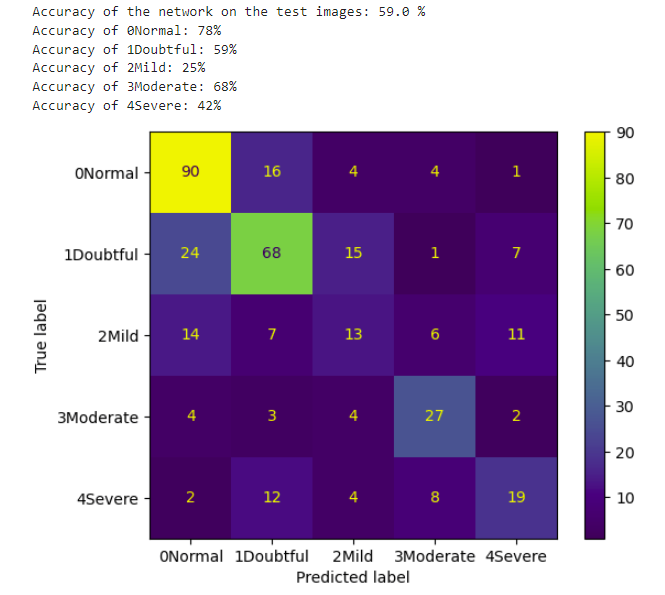

# Model Card

## Model Description

**Input:** 
A 162x300 x-ray image of a single human knee joint.

**Output:** 
The grade of osteoarthritis according to the Kellgren and Lawrence grading system:
- 0 (Normal)
- 1 (Doubtful)
- 2 (Mild)
- 3 (Moderate)
- 4 (Severe)

**Model Architecture:** 
The CNN uses the LeNet architecture. It consists of two convolution layers, two max pooling layers and three fully connected layers.
- The convolution kernel has size (4x4), 64 filters, a stride of 1 and no padding.
- The max pooing kernel has size (2x2), a stride of 2 and no padding.
- The first fully connected layer has 120 output features (neurons)
- The second fully connected layer has 84 output features (neurons)
- The ReLu activation function is applied after each convolution and fully connected layer.

The optimiser used is toch.optim.Adam and the criterion used is torch.nn.CrossEntropyLoss.

## Performance

The model is trained on a random 75% sample of the single-knee image data, and tested on the remaining 25%. An accuracy of 59% is achieved on the unseen test data. 

The confusion matrix and accuracy by class on the test data can be seen below.

 

## Limitations

The model can only be used on single knee x-rays. It is limited in use by its low accuracy score. 
- 

## Trade-offs

The model performs particularly poorly on Mild and Severe images. The accuracy for the Mild category is barely better than a random guess which 27% of the Severe images are misclassified as Doubtful.

